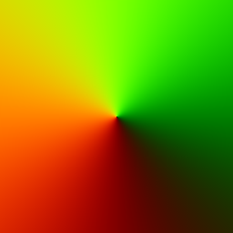

# WebGL-Boids

This is a small Boids Simulation in webGL completly calculated on the GPU with Transfrom Feedbacks. It is used in my protfolio Website.

The Boids can also be forced into a flow pattern using a force texture. A generator for force textures (written in Java) can be found in "./forceFieldTextureCreator".

